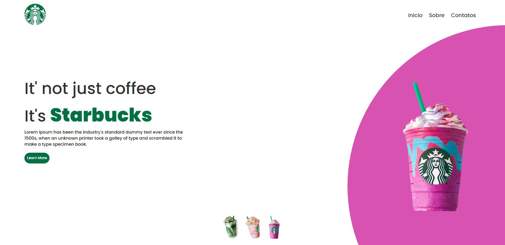

<h1 align="center"> Página da Starbucks </h1>

<h2>OBJETIVO</h2>

Criar uma página com design limpo, sempre com o objetivo de aprimorar meus conhecimentos em HTML, CSS e JavaScript.

<h2> RESULTADO</h2>

<h2>ACESSE</h2>

<h2>FERRAMENTAS</h2>

<ul>
  <li>HTML</li>

  <li>CSS</li>

  <li>JavaScript</li>
</ul>